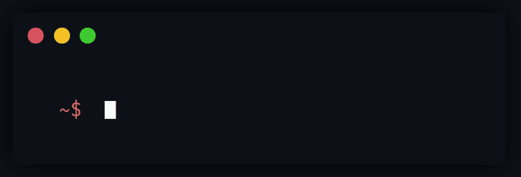

<!--## Hi Everyone, Welcome To My Personal GitHub Profile! 👋-->

  <h2>
    Hi Everyone, Welcome To My Personal GitHub Profile!
    

 

<!--
**SmashedFrenzy16/SmashedFrenzy16** is a ✨ _special_ ✨ repository because its `README.md` (this file) appears on your GitHub profile.
-->

<!--

   

-->

<!--

-->
<!---->

### About Me, @SmashedFrenzy16

  
  

Hello everyone! My name is SmashedFrenzy16. I am a back-end developer and a front-end developer. I joined GitHub on July 30th 2020, and started my path to create all sorts of projects that I could make for the rest of the world. I mostly work in Python, HTML and C++, building all sorts of different repositories that meet people's different needs. I also collaborate with other developers. I have been developing and curating my skills over 2 years to try and help you improve the way you use your computers. Today, after quite a bit of time on open-source coding (which a lot of the GitHub community have helped me by supporting me every step of the journey, so thanks 😀), I have got a plethora of new, high demanded projects and code for you to use all free of charge.

### Other Things About Me

- 🔭 I’m currently working on the [SmashedFrenzy16 Web3 Project](https://smashedfrenzy16.dao) (to configure your browser to support Web3 domains to view the homepage of the SmashedFrenzy16 Web3 Project, click [here](https://www.makeuseof.com/access-unstoppable-domains-websites/)).
- 🌱 I’m currently learning GDScript, ethical hacking and AWS.
- ✨ I’m looking for the best programming opportunities on GitHub, as well as contributing to common GitHub repos and projects.
- 🤔 I’m looking for help with ethical hacking and C#.
- 💬 Ask me about how to make attractive profile READMEs, how to code in Python and C++, how to effectively use GitHub in general and even more, which can be found on my sponsors profile! I might be able to help you.
- 📫 How to reach me: On [GitHub](https://github.com/SmashedFrenzy16), [X (Twitter)](https://x.com/SmashedFrenzy16), [Google+](https://plus.google.com/+SmashedFrenzy16) and [Email](mailto:smashedfrenzy16@gmail.com)
- 😄 Pronouns: He/him
- ⚡ Fun fact: My favourite programming language is Python!

### Profile Badges

  

### Tools That I Use

#### Softwares

<a href="#">

#### Programming Languages

### Technologies

<code></code>
<code></code>
<code></code>
<code></code>
<code></code>
<code></code>
<code></code>
<code></code>
<code></code>
<code></code>	
<code></code>
<code></code>
<code></code>
<code></code>
<code></code>
<code></code>
<code></code>
<code></code>
<code></code>
<code></code>
<code></code>

### Holopin Badges

<h3>Most Used Languages (by number of commits):</h3>

	
  
<!---->
	
### Quotes By Famous Developers!

### Random Joke For You To Enjoy!

### Latest News from SmashedFrenzy16 and NetFruit Technologies

What's New: donutOS will be breaking the surface soon, so be ready for it by following NetFruit Technologies on all platforms for the latest updates!

Note: I am starting Godot Game Engine projects and developing games in general.

Another Note: I will start uploading scripts in the near future related to IoT and other cool things relating to all kinds of projects! So stay tuned and follow me for any updates!
	
<!--

-->

	
<h3>Follow me ✨</h3>

- Follow me on Google+: https://plus.google.com/+SmashedFrenzy16
- Follow me on GitHub: https://github.com/SmashedFrenzy16
- Follow me on Twitter: https://twitter.com/SmashedFrenzy16
- View me and like my posts on Adobe Behance: https://www.behance.net/smashedfrenzy16
- Check out my personal website: https://smashedfrenzy16.github.io/
- Check out my website: https://netfruittechnologies.wordpress.com
- Check out my second website: https://netfruit-technologies.business.site/
- Check out my blog: https://netfruittechnologies.blogspot.com
- Check out and sign up to my forum: https://netfruittechnologies.forumotion.com/
- Subscribe to my feed: https://feeds.feedburner.com/NetFruitTechnologies
- Subscribe to my Youtube channel: https://www.youtube.com/channel/UCYgonjsSvGmJVyNaA4uki8Q?sub_confirmation=1
- Check out my GitHub Gist profile: https://gist.github.com/SmashedFrenzy16
- Send me a friend request, follow me and message me on Chess.com: https://www.chess.com/member/calmxbop7462
- Check out my Google Developer Profile: https://developers.google.com/profile/u/SmashedFrenzy16
- Check out my Stack Overflow profile: https://stackoverflow.com/users/16224707/smashedfrenzy16
- Check out my CodersRank profile: https://profile.codersrank.io/user/SmashedFrenzy16

  

You are visitor number:

  
Best viewed with: 

Can no longer be viewed with: 

 
<!---->
 

  
  

